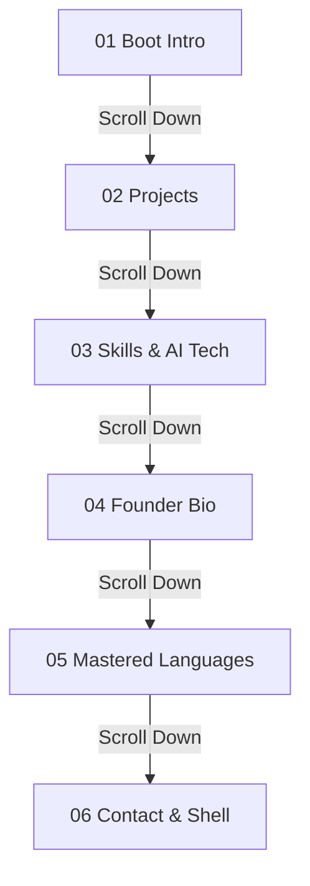

# 💻 Single-Canvas 3D Spatial Portfolio
### **Naitik Talreja (@vibe-coder)**
**Founder & CEO at [Qwenton](https://qwenton.shop) • AI Automations & Autonomous Personal Agents Architect**

[](https://qwenton.shop)
[](https://github.com/naitik99045)
[](https://www.linkedin.com/in/netik-talreja-31ba67426)
[](https://instagram.com/Naitik_talreja1)
[](#performance--tech-stack)

---

## 🌟 Overview

An award-winning caliber, **single-canvas 3D spatial portfolio** engineered for **Naitik Talreja** (`@vibe-coder`), owner & founder of **Qwenton** ([qwenton.shop](https://qwenton.shop)). 

The entire experience is anchored inside a single high-performance WebGL Canvas containing a procedural, Apple MacBook Pro 3D chassis. All interactive content (Projects, Vibe Coding Skills, Founder Bio, Mastered Programming Languages, and Tabbed Contact Center) renders directly on the 3D monitor screen with real-time anisotropic canvas textures, OLED ambient emission, and smooth scroll choreography.

---

## ⚡ Core Features

- 🖥️ **Single-Canvas 3D WebGL Scene:** Seamless 60 FPS viewport transitions powered by React Three Fiber & Three.js.
- 📐 **Procedural MacBook Pro Chassis:** Realistic aluminum unibody, glass precision trackpad, speaker grills, MagSafe/Thunderbolt ports, and webcam LED.
- ⌨️ **Dynamic 3D Mechanical Keyboard:** 3D keycaps physically depress with spring physics and LED backlighting as skills and search queries are typed.
- 🎨 **High-DPI Retina Canvas Display:** 2048×1280 dynamic WebGL texture rendering with 16× anisotropic filtering, sub-pixel antialiasing, and ambient OLED screen glow.
- 🏢 **Qwenton Startup Ecosystem:** Direct showcase for enterprise AI automations, autonomous personal agent swarms, and bespoke 3D spatial web canvases.
- 🎵 **Web Audio Haptic Feedback:** Synthesized retro boot chime, tactile mechanical keypress clicks, and sound toggle controls.
- 📱 **2D Fallback Mode:** Instant toggle between 3D Spatial Canvas and an ultra-clean semantic 2D view for accessibility and low-powered devices.

---

## 🗺️ 6-Section Architecture



| # | Section | Display & Camera Choreography | Key Content |
| :---: | :--- | :--- | :--- |
| **01** | **Hero Boot** | Gentle 16° perspective angle; 3D chassis elevation. | Vibe-OS kernel initialization, Founder & CEO badge, direct links to `qwenton.shop`. |
| **02** | **Projects** | Eye-level zoom into the 3D screen (`Z = 1.80`). | Interactive macOS browser tabs featuring **`qwenton.shop`**, **`qwenton-ui`**, **`vibe-coder-portfolio`**, and **`AgentMesh`**. |
| **03** | **Skills** | Hybrid angle framing both screen profiler and 3D keyboard. | **Vibe Coding**, **3D Project Builder**, **Autonomous AI Agents**, **Model Context Protocol (MCP)**, and **Next.js 14**. |
| **04** | **Founder Bio** | Front-and-center display framing. | Complete manifesto for **Qwenton**: selling tailored AI automations and autonomous personal agents for companies. |
| **05** | **Languages** | Front-and-center display framing. | 8 Mastered Languages: **C++**, **Python**, **Rust**, **Go (Golang)**, **Ruby**, **C# (.NET)**, **TypeScript/JS**, and **GLSL Shaders**. |
| **06** | **Contact** | Full laptop framing with interactive controls. | Tabbed center: Direct Socials, Qwenton Enterprise Inquiries, and interactive CLI Shell (`naitik@portfolio:~$`). |

---

## 🛠️ Tech Stack & Architecture

- **Core Framework:** [Next.js 14](https://nextjs.org/) (App Router, React Server Components)
- **3D & WebGL Engine:** [Three.js](https://threejs.org/) & [@react-three/fiber](https://docs.pmnd.rs/react-three-fiber)
- **3D Helper Utilities:** [@react-three/drei](https://github.com/pmndrs/drei)
- **Styling & Design System:** [Tailwind CSS](https://tailwindcss.com/)
- **Icons & Visuals:** [Lucide React](https://lucide.dev/)
- **Audio Engine:** HTML5 Web Audio API (tactile clicks & synthesizer chime)
- **Language & Types:** [TypeScript](https://www.typescriptlang.org/) (Strict Mode)

---

## 📂 Project Structure

```
portfolio/
├── src/
│   ├── app/
│   │   ├── globals.css              # Global styles, font definitions & scrollbar styling
│   │   ├── layout.tsx               # Root Next.js layout with SEO metadata
│   │   └── page.tsx                 # Main single-canvas page controller & HUD
│   ├── components/
│   │   ├── canvas/
│   │   │   ├── CameraController.tsx # 6-checkpoint smooth camera interpolation
│   │   │   ├── Scene.tsx            # Master 3D WebGL Canvas & studio lighting
│   │   │   └── Laptop/
│   │   │       ├── Keyboard3D.tsx   # 3D mechanical keycaps with spring physics
│   │   │       ├── LaptopBase.tsx   # Unibody aluminum chassis, trackpad & ports
│   │   │       ├── LaptopModel.tsx  # Master laptop group with lid angle dampening
│   │   │       ├── LaptopScreen.tsx # Screen bezel, display mesh & OLED glow
│   │   │       └── ScreenTextureGenerator.ts # 2048x1280 dynamic texture generator
│   │   ├── screens/                 # 2D Screen components
│   │   │   ├── AboutScreen.tsx      # Founder bio & verified link cards
│   │   │   ├── ContactScreen.tsx    # Tabbed contact center & CLI shell
│   │   │   ├── HeroBootScreen.tsx   # Vibe-OS boot terminal
│   │   │   ├── LanguagesScreen.tsx  # Mastered languages inspector
│   │   │   ├── ProjectsScreen.tsx   # Browser UI with tabbed projects
│   │   │   ├── ScreenContainer.tsx  # macOS window frame wrapper
│   │   │   └── SkillsScreen.tsx     # Synced skills profiler
│   │   └── ui/
│   │       ├── AudioController.ts   # Web Audio synthesized sound manager
│   │       ├── NavigationOverlay.tsx# Floating HUD, section dock & sound toggles
│   │       └── SemanticFallback.tsx # 2D accessible view mode
│   └── data/
│       └── portfolioData.ts         # Central portfolio data & verified links
├── .gitignore                       # Production Git ignore configuration
├── package.json                     # Project dependencies & scripts
├── README.md                        # Documentation & setup guide
├── tailwind.config.js               # Tailwind CSS configuration
├── tsconfig.json                    # TypeScript compiler configuration
└── urls.txt                         # Verified founder & startup URLs
```

---

## 🚀 Getting Started

### Prerequisites
- Node.js 18.17+ or Node.js 20+
- npm, yarn, or pnpm

### Installation

1. **Clone the repository:**
   ```bash
   git clone https://github.com/naitik99045/portfolio.git
   cd portfolio
   ```

2. **Install dependencies:**
   ```bash
   npm install
   ```

3. **Run development server:**
   ```bash
   npm run dev
   ```

4. **Open in browser:**
   Navigate to [http://localhost:3000](http://localhost:3000).

### Production Build

```bash
npm run build
npm run start
```

---

## 🌐 Verified Links

- **Startup Website:** [https://qwenton.shop](https://qwenton.shop)
- **GitHub Profile:** [https://github.com/naitik99045](https://github.com/naitik99045)
- **Qwenton UI Library:** [https://github.com/naitik99045/qwenton-ui](https://github.com/naitik99045/qwenton-ui)
- **LinkedIn:** [https://www.linkedin.com/in/netik-talreja-31ba67426](https://www.linkedin.com/in/netik-talreja-31ba67426)
- **Instagram:** [@Naitik_talreja1](https://instagram.com/Naitik_talreja1)

---

## 📜 License

Created with ❤️ by **Naitik Talreja** ([@vibe-coder](https://github.com/naitik99045)). Open source under the [MIT License](LICENSE).
